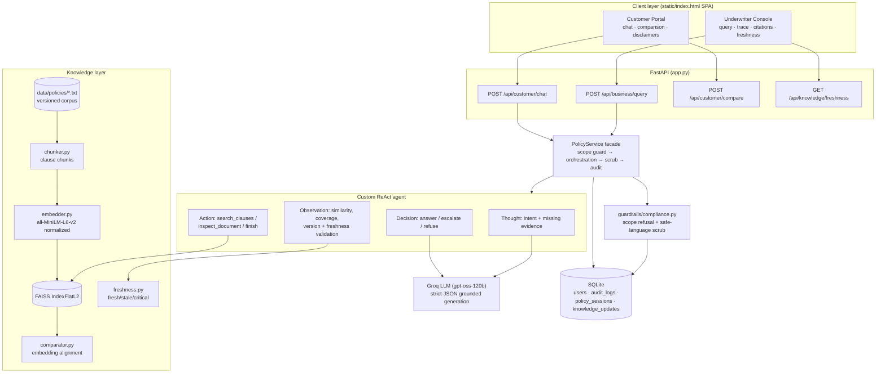

# Architecture — Policy & Knowledge Management Assistant

## 1. RAG + Agent architecture diagram



## 2. Ingestion & versioning pipeline

```
data/policies/<doc>.txt
   │  header: Title / Doc Type / Product Line / Policy Id /
   │          Version / Effective Date / Supersedes / Approved By
   ▼
sha256 content hash ──► manifest check (data/indexes/policy_chunks.json)
   │ unchanged → load cached FAISS index (fast boot)
   │ changed/new → full rebuild
   ▼
clause chunking (knowledge/chunker.py)
   • split on numbered clause boundaries ("1.", "3.1", "4.2" …)
   • each chunk keeps its parent ref ⇒ exact citations (§3.2)
   • clauses > 900 chars are sentence-split; sub-chunks inherit the ref
   ▼
embedding (all-MiniLM-L6-v2, normalize_embeddings=True)
   ▼
FAISS IndexFlatL2 build + save (data/indexes/policy_index.bin)
```

**Why clause-level chunking?**
1. Insurance wordings are legally structured; a clause is a self-contained semantic and citable unit.
2. Chunk boundaries never truncate meaning mid-sentence of obligation/exclusion.
3. Citation refs are exact and human-verifiable ("§4 Exclusions"), which powers traceability.
4. Long clauses are sentence-split under a size cap so embeddings stay topical.

**Embedding model choice:** `all-MiniLM-L6-v2` — 384-dim, CPU-friendly for a corpus of hundreds of clauses, strong retrieval on short technical text, and normalized vectors make `IndexFlatL2` distance equal to cosine distance (`sim = 1 - d²/2`).

**Similarity threshold handling:** retrieval discards hits below **0.30** before the LLM ever sees them. If nothing passes, the agent escalates instead of answering — an empty context must never become creative filler.

## 3. Custom ReAct agent design (`agents/policy_agent.py`)

| Phase | Implementation |
|-------|----------------|
| Thought | LLM interprets query intent + what evidence is still missing (heuristic intent classifier seeds step 1) |
| Action | tools: `search_clauses(query)` semantic search, `inspect_document(doc_id)` full-document read, `finish` |
| Observation | deterministic code validates: hit count, top similarity, per-chunk version + freshness status |
| Loop control | max 4 steps; re-query with rephrased terminology when weak; early-finish at ≥5 clauses with top sim ≥0.60 |
| Decision | answer / escalate — decided in code from evidence, staleness, confidence (<0.45) and `cannot_determine`; never by the LLM |

Escalation triggers (human-in-the-loop):
- no clause passed the similarity threshold,
- grounded generator reports it cannot determine the answer,
- cited document is past its critical review window (>730 days),
- confidence below threshold after freshness/degradation penalties.

Failure degradation: any LLM/JSON failure falls back to (a) salvaging the `answer` field, then (b) a deterministic source-listing template — both flagged `_degraded`, which itself forces escalation rather than silent trust.

## 4. Freshness & validation controls

- Every chunk carries `version` + `effective_date` from the corpus header.
- Status bands: `fresh ≤365d`, `stale >365d` (answers carry warnings), `critical >730d` (auto-escalate). Undated = critical.
- Confidence is multiplied down (×0.8 stale, ×0.6 critical) so scores reflect version risk.
- The append-only update log feeds `/api/knowledge/freshness` and the underwriter dashboard.
- Precedence rule from the ingested SOP is surfaced in prompts: regulatory circulars > endorsements > base wording > older versions.

## 5. Separation of interaction flows

| Aspect | Business track | Customer track |
|--------|---------------|----------------|
| Endpoint | `/api/business/query` | `/api/customer/chat`, `/api/customer/compare` |
| Reasoning trace | Full Thought/Action/Observation timeline | Never exposed |
| Clause payloads | Up to 8 verbatim clauses w/ versions | Top 4 only (context overload control); no raw dumps |
| Language | Technical, precedence-aware, ambiguity flags | Simplified, empathetic, jargon-translated |
| Citations | Validated inline `[doc §ref]` chips | Source chips ("where this comes from") |
| Failure mode | Escalate to senior underwriter | Friendly hand-off to service team |
| Disclaimers | Internal decision-support notice | Three compliance disclaimers incl. "not legal advice" |

## 6. Comparison engine

`knowledge/comparator.py`: embed every clause of both documents; for each clause of A take the best cosine match in B; label pairs deterministically — `same ≥0.75`, `different 0.45–0.75`, else `only_a`; unmatched B-clauses surface as `only_b`. An LLM writes a neutral factual narrative strictly over these computed pairs — it never decides what differs, only explains it. Premium/pricing comparisons are intentionally excluded (out of scope).
